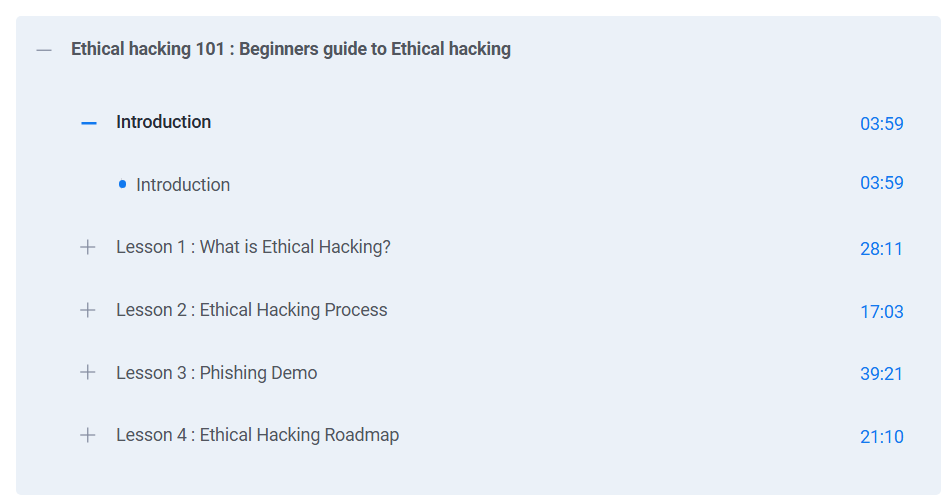

# 🕵️ Ethical Hacking 101 – Beginner’s Guide (Simplilearn)

This repository contains **notes, labs, playbooks, research case studies, and certificate of completion** for the *Ethical Hacking 101 – Beginner’s Guide (Simplilearn)* program.  
The course provides a solid foundation in **penetration testing, reconnaissance, exploitation techniques, and defensive countermeasures**.

---

## 📚 Notes
- 📄 [01-introduction-to-ethical-hacking.md](./notes/01-introduction-to-ethical-hacking.md) – Introduction to Ethical Hacking  
- 📄 [02-footprinting-and-reconnaissance.md](./notes/02-footprinting-and-reconnaissance.md) – Footprinting & Reconnaissance  
- 📄 [03-scanning-and-enumeration.md](./notes/03-scanning-and-enumeration.md) – Scanning & Enumeration  
- 📄 [04-system-hacking.md](./notes/04-system-hacking.md) – System Hacking Techniques  
- 📄 [05-malware-and-trojans.md](./notes/05-malware-and-trojans.md) – Malware & Trojans  
- 📄 [06-sniffing-and-spoofing.md](./notes/06-sniffing-and-spoofing.md) – Sniffing & Spoofing Attacks  
- 📄 [07-social-engineering.md](./notes/07-social-engineering.md) – Social Engineering  
- 📄 [08-dos-ddos.md](./notes/08-dos-ddos.md) – DoS & DDoS Attacks  
- 📄 [09-session-hijacking.md](./notes/09-session-hijacking.md) – Session Hijacking  
- 📄 [10-web-application-attacks.md](./notes/10-web-application-attacks.md) – Web App Attacks  
- 📄 [11-sql-injection.md](./notes/11-sql-injection.md) – SQL Injection  
- 📄 [12-wireless-attacks.md](./notes/12-wireless-attacks.md) – Wireless Security Attacks  
- 📄 [13-ids-firewalls-honeypots.md](./notes/13-ids-firewalls-honeypots.md) – IDS, Firewalls & Honeypots  
- 📄 [14-cryptography.md](./notes/14-cryptography.md) – Basics of Cryptography  
- 📄 [15-penetration-testing.md](./notes/15-penetration-testing.md) – Penetration Testing  
- 📄 [16-case-studies-and-final.md](./notes/16-case-studies-and-final.md) – Case Studies & Final Review  

---

## 🧪 Labs
- 🔑 [password-cracking-lab.md](./labs/password-cracking-lab.md) – Hands-on with password attacks  
- 📡 [sniffing-lab.md](./labs/sniffing-lab.md) – Network sniffing & spoofing lab  
- 💉 [sql-injection-lab.md](./labs/sql-injection-lab.md) – SQL Injection practice  
- 🛡️ [xss-lab.md](./labs/xss-lab.md) – Cross-Site Scripting exploitation  

---

## 📋 Playbooks
- 📄 [phishing-playbook.md](./playbooks/phishing-playbook.md) – Phishing response playbook  
- 📄 [sql-injection-playbook.md](./playbooks/sql-injection-playbook.md) – SQL Injection handling playbook  
- 📄 [xss-playbook.md](./playbooks/xss-playbook.md) – XSS exploitation & defense playbook  

---

## 🔬 Research
- 📑 [extras/case-studies.md](./extras/case-studies.md) – Case studies on real-world attacks  
- 📆 [extras/timeline.md](./extras/timeline.md) – Timeline of notable cyber attacks  
- 📘 [extras/resources.md](./extras/resources.md) – Extra resources & references  

---

## 📖 Docs
- 📘 [docs/glossary.md](./docs/glossary.md) – Key terms in Ethical Hacking  
- 📘 [docs/index.md](./docs/index.md) – Program overview  
- 📘 [docs/references.md](./docs/references.md) – References & readings  
- 📘 [docs/roadmap.md](./docs/roadmap.md) – Roadmap for learning Ethical Hacking  
- 📘 [docs/syllabus.md](./docs/syllabus.md) – Course syllabus  

---

## 📸 Course Preview

| Step | Screenshot |
|------|------------|
| 📖 What Will You Learn |  |

---

## 📜 Certificate
🎓 [Ethical Hacking 101 – Beginner’s Guide (Simplilearn)](./cert/Ethical%20hacking%20101%20Beginners%20guide%20to%20Ethical%20hacking.pdf)

---

## 📝 Personal Review
This course gave me a **strong foundation in ethical hacking techniques**, from **reconnaissance and scanning to exploitation and penetration testing**. The labs (SQL Injection, XSS, Sniffing, and Password Cracking) provided **practical, hands-on skills** for both offensive and defensive security.  
It is a great starting point for anyone aspiring to pursue **penetration testing or red team operations**.

---

## ⚠️ Disclaimer
This repository is strictly for **educational and research purposes**. The author does not endorse or promote malicious hacking activities. All techniques should be practiced in **legal, controlled environments** only.

---

## ✍️ Author
**Thành Danh** – Red Team Learner & Security Researcher  

- GitHub: [@ngvuthdanhh](https://github.com/ngvuthdanhh)  
- Email: ngvu.thdanh@gmail.com  

---

## 📄 License
This project is licensed under the terms of the **MIT License**. See [LICENSE](./LICENSE) for full details.  
© 2025 ngvuthdanhh. All rights reserved.
